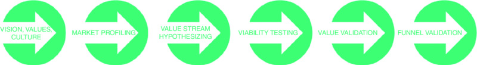
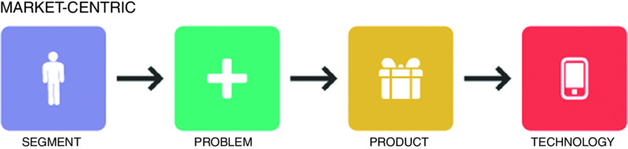
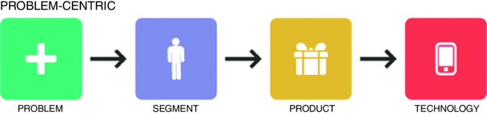
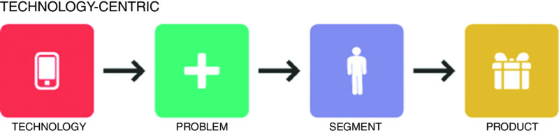
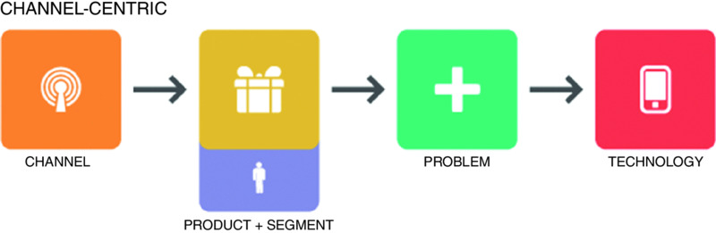

>What is a LEAN startup?

The objective of a lean startup is to elimate waste in the discovery of value and whome it's being created.

### THE VALUE-CREATION ECONOMY

- Having a product experience that exceeds their needs.
- Having a relationship with the company in which the company treats them respectfully.
- Having a voice in the product.

> Value-adding activities are those that directly contribute to the production or delivery of value—for example, assembling part of a car. Non-value-adding activities are those that don’t contribute to the value being produced—for example, forklifting parts from one side of a warehouse to another.

### 

>Follow your passion is easily the worst advice you could ever give or get.

—Mark Cuban, businessman, investor, and billionaire (ergo: visionary)2

### Market-Centric

### Problem-Centric

But beware: This can be a trap, on two levels. First, just because you have experienced the problem doesn’t mean that there is an addressable market segment for it. Second, you may be biased toward a solution that the market majority doesn’t want.

A notable difference between the market-centric and problem-centric business models is that the problem-centric model ultimately pursues anyone who has the problem, whereas the market-centric model seeks to solve many problems experienced by one market.

### Product-Centric

### Technology-Centric 

### Channel-Centric 

>According to author Steven Spear, the only way for an enterprise to truly thrive is to become a high-velocity organization. A high-velocity organization continuously produces higher-quality products while also continuously improving the processes of producing product. This, Spear argues, is the forgotten lesson of the Toyota Production System: that Toyota figured out “how to do the work in such a way that individuals and groups kept learning how to do that work better.”3

